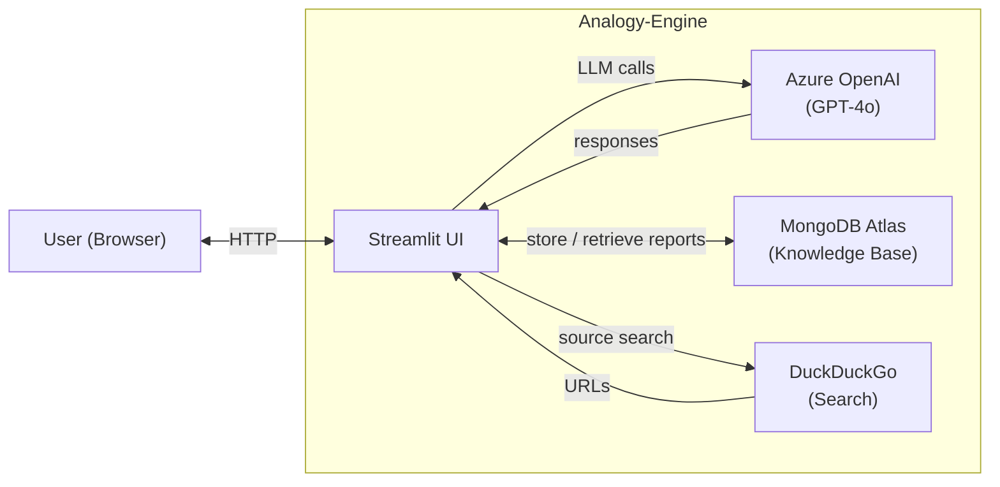
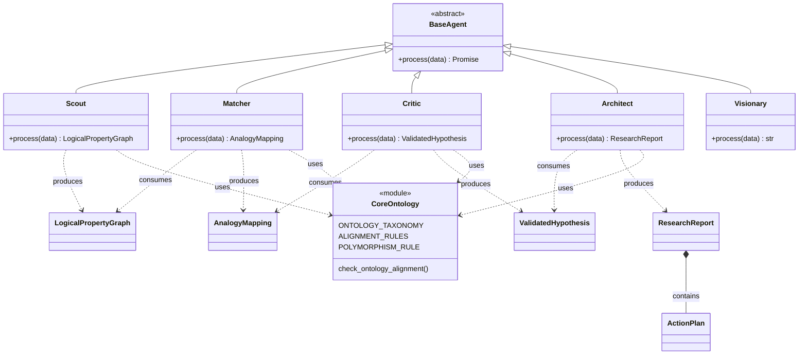

# Analogy-Engine: Architecture & Agent Flow

This document describes the system architecture, the multi-agent pipeline (including the refinement loop), the high-level C4 context, and the core class structure.

---

## 1. System Sequence Diagram (Agent Loop)

The flow starts from the Streamlit app (`app.py`). User input (source and target domain texts) is sent to the Scout; the Matcher aligns graphs with polymorphism (same ontological type only); the Critic validates. If the Critic rejects (low confidence or ontology mismatch), a **refinement loop** runs: the Matcher refines the mapping using critic feedback, then the Critic validates again. Once accepted, the Architect synthesizes the final report.

```mermaid
sequenceDiagram
    participant User
    participant App
    participant Scout
    participant Matcher
    participant Critic
    participant Architect

    User->>App: source text, target text
    App->>Scout: text (source)
    Scout->>App: LogicalPropertyGraph (graph_a)
    App->>Scout: text (target)
    Scout->>App: LogicalPropertyGraph (graph_b)

    App->>Matcher: graph_a, graph_b
    Matcher->>Matcher: Align with Polymorphism
    Matcher->>App: AnalogyMapping

    App->>App: check_ontology_alignment
    alt ontology mismatch
        App->>Critic: skip; hypothesis = inconsistent
    else ontology ok
        App->>Critic: AnalogyMapping
        Critic->>App: ValidatedHypothesis
    end

    loop Refinement until consistent and confidence >= 0.8
        alt not consistent or confidence < 0.8
            App->>Matcher: graph_a, graph_b, previous_mapping, critic_feedback
            Matcher->>App: refined AnalogyMapping
            App->>App: check_ontology_alignment
            alt ontology mismatch
                App->>Critic: skip; final_hypothesis = inconsistent
            else ontology ok
                App->>Critic: refined AnalogyMapping
                Critic->>App: ValidatedHypothesis
            end
        end
    end

    App->>Architect: ValidatedHypothesis (final)
    Architect->>Architect: Synthesize
    Architect->>App: ResearchReport
    App->>User: report, store (Librarian)
```

---

## 2. High-Level C4 Architecture (Context)

The user interacts with the Analogy-Engine via the browser. The system boundary contains the Streamlit UI, which orchestrates the pipeline and calls Azure OpenAI (GPT-4o) for agent reasoning, MongoDB Atlas for the Knowledge Base, and DuckDuckGo for source collection.



---

## 3. Class Diagram (Core Logic)

The pipeline agents (Scout, Matcher, Critic, Architect, Visionary) inherit from `BaseAgent` and produce/consume Pydantic models from `core.schema`. The Triple-Layer Ontology in `core.ontology` is used by Scout, Matcher, and Critic for tagging and alignment; the Architect uses signal/state and decoupling guidance from the same module.



---

## References

- **Pipeline implementation:** [app.py](../app.py) (`run_pipeline`), ontology check via [core.ontology.check_ontology_alignment](../core/ontology.py)
- **Schema:** [core/schema.py](../core/schema.py) (LogicNode, LogicalPropertyGraph, AnalogyMapping, ValidatedHypothesis, ResearchReport)
- **Ontology:** [core/ontology.py](../core/ontology.py) (Triple-Layer: STRUCTURE, FUNCTION, ATTRIBUTE)
